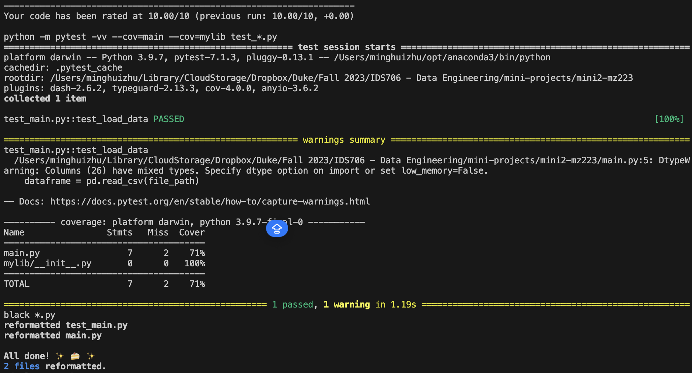

[](https://github.com/nogibjj/mini4-mz223/actions/workflows/cicd.yml)

# Week 2 Mini-project: Pandas Descriptive Statistics Script

## Overview
This repository contains a Python script (`main.py`) for loading a CSV file into a pandas DataFrame and printing its shape. The script is an introductory example of using pandas for data analysis, specifically for understanding the structure of a dataset.

## Installation

Before running the script, ensure you have Python installed on your system. This script was written using Python 3.9.7, but it should be compatible with any Python 3.x version.

Additionally, you'll need to install pandas. It's recommended to use a virtual environment:

```bash
python -m venv venv
source venv/bin/activate  # On Windows use `venv\Scripts\activate`
pip install pandas
```

Usage
To execute the script, run the following command from the root of the repository:
```
python main.py
```
The script will load the data from ./assets/datasets/credit/train.csv and print the shape of the DataFrame to the console.

Project Structure
* `main.py`: The main script file.
* `assets/datasets/credit/train.csv`: The dataset file (not included in the repository).
* `requirements.txt`: The file listing the necessary Python dependencies.
* `test_main.py`: Contains unit tests for main.py to ensure the load function works correctly.

## Continuous Integration with GitHub Actions

The project uses GitHub Actions, employing the following commands:

- `make install`: Installs project dependencies.
- `make test`: Runs unit tests.
- `make format`: Formats the code according to the specified style.
- `make lint`: Checks the code for potential errors and style issues.


### CI Results
[Please click here](https://github.com/nogibjj/mini4-mz223/actions)
